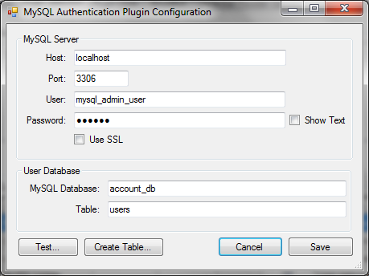

pGina MySQL Authentication Plugin Documentation
===================

* **Plugin Name:** MySQL Authentication
* **Plugin Type:** Authentication
* **Latest Version:** 3.0.2.0

How it Works
-----------------

The MySQL Authentication plugin authenticates users against account information stored in a 
MySQL database.  The plugin connects to the MySQL server, retrieves the account information
including password (possibly a hash), and compares the user supplied password with the one
retrieved from the database.  It registers success if the passwords (or hashes) match.

The MySQL database can store plain text passwords or password hashes.  The plugin currently 
supports the following hashes: MD5, SHA1, SHA256, SHA384, and SHA512.

The MySQL Authentication plugin expects user information to be stored in a table with a 
specific schema.  The configuration UI can be used to create the table (see below).  Users
can be added using standard SQL.  Since pGina does not currently support password changes,
password changes currently need to be supported by your own tools.

Typical Setup
-------------------

A typical (minimal) setup for MySQL Authentication is to enable the Local Machine plugin in the 
authentication and gateway stages, and enable MySQL Auth. in the authentication stage.  Within the 
authentication stage, order the MySQL plugin before Local Machine.

Configuration
-------------------

* **Host** -- The IP or fully-qualified hostname of the MySQL server.
* **Port** -- The port where the MySQL server process is listening.
* **User** -- The username to use when connecting to the MySQL server.
* **Password** -- The password to use when connecting to the MySQL server.
* **Use SSL** -- Whether or not to use SSL encryption when connecting to the MySQL server.
Note that for this to work correctly, your MySQL server must have SSL enabled.  For more 
information on setting up a MySQL server with SSL, see 
[the MySQL documentation](http://dev.mysql.com/doc/refman/5.1/en/secure-connections.html).
* **MySQL Database** -- The database containing the account information table.
* **Table** -- The name of the account information table.

The "Test..." button initiates a test of the MySQL connection, and verifies that the account
table exists and is properly formatted.

The "Create Table..." button attempts to connect to the MySQL server and create the account
information table.