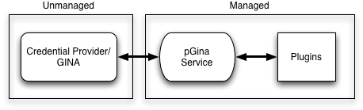

pGina Core Developer Documentation
===================

## Contents
* [The pGina Architecture](#arch)
* [The Credential Provider](#cp)
* [The GINA](#gina)
* [The pGina Service](#service)

--------

<h2 id="arch">The pGina Architecture</h2>

pGina's architecture is based on three main components:  the credential provider/GINA,
the pGina service, and the plugins.  The image below shows the 
components and their relationship to eachother.

The Credential Provider or GINA augments or replaces
the default Windows authentication functionality.  In Windows Vista or later,
this component is called a Credential Provider (CP), in prior versions of Windows, we
it is a GINA.  More details on each of these options is provided below,
suffice it to say for now that this component plugs-in to the Windows
authentication system and can configure parts of what is requested (username/
password), and what is displayed (logo, MOTD, etc.).  In a standard login,
the CP/GINA receives the 
user's credentials and passes them along to the pGina Service via a named pipe.

The pGina Service is the core of the pGina system.  It recieves the credentials
from the CP/GINA and then activates the plugins which are responsible for 
the authentication, authorization, and other login time actions.  The pGina
service does no authentication/authorization on its own.  Instead, it is 
up to the plugins to do this work.  The pGina service is essentially 
a "traffic cop" that invokes
the plugins in their configured order and determines the overall result based
on the results returned by the plugins.

The plugins and the pGina service are both written in C# on the .NET 4.0 
platform.  The CP/GINA is (and must be) written in unmanged C++.  Communication
between the CP/GINA and the service is done via a named pipe.  The plugins are
loaded at startup by the service and enumerated using reflection.

<h2 id="cp">The Credential Provider</h2>

In Windows Vista and later, in order to provide alternate methods of authentication
and/or authorization, one must implement a Credential Provider (CP).  The CP 
can configure the UI that is presented to the user, as well as determine
the result of the authentication.  A CP is a COM object that is loaded
and instantiated by the `LogonUI.exe` process when a user is presented the 
opportunity to unlock, login, or otherwise interact with the `winlogon.exe`
process.

The pGina
CP is defined within the main code distribution in the directory: 
`pGina/src/CredentialProvider`.  It consists of two main parts: the provider 
and the credential  (naturally enough).
The provider class implements `ICredentialProvider`.  In pGina, this class
is named `pGina::CredProv::Provider` (located in `Provider.cpp|h`).  The credential
class implements `ICredentialProviderCredential` and the pGina implementation
is `pGina::CredProv::Credential` located in `Credential.cpp|h`. 

When initializing a login/unlock/CredUI scenario, the following steps occur:

1. The provider object is told the scenario that it is running under via a call
to `SetUsageScenario`.  
2.  The provider is asked about how many credentials it provides via a call to
`GetCredentialCount`.  This equates to the number of tiles that you will see
in the resulting UI.  For example, the default credential provider usually
displays one tile for each local user.
3.  The provider is then queried for a `ICredentialProviderCredential` object
for each credential via `GetCredentialAt`.  In this function, we create a 
`Credential` object, initialize it, and provide it to the caller (via an
output argument).  The pGina CP only provides a single credential object.

The provider object also defines the number of fields that are presented to
the user in the UI.  A field is a UI element such as a text-box, image,
label, or button, and each field has a name and other properties.  
All credentials from a given provider (in a given scenario) have the same number
of fields as provided by the function `GetFieldDescriptorCount`.  High level details
about each field (name, id and type) are provided via `GetFieldDescriptorAt`.

The credential object provides detailed information about the UI fields via 
the functions `GetFieldState` and `Get[Type]Value[At]`.  
 

<h2 id="gina">The GINA</h2>

TODO...

<h2 id="service">The pGina Service</h2>

TODO...

