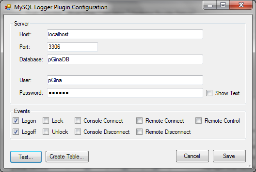

pGina MySQL Logger Plugin Documentation
===================

* **Plugin Name:** MySQL Logger
* **Plugin Type:** Notification
* **Latest Version:** 3.0.0.0

How it Works
----------------

The MySQL Logger plugin logs various events to a MySQL database.  These include logon, logoff, 
lock, unlock, console connect/disconnect, and others.  Along with the time of each event, 
the plugin also logs the host name, IP address, and machine name of the machine that 
generated the event.  

This plugin expects a specific table schema.  The table can be created using the configuration
utility (see below).

Configuration
-------------------

* **Host** -- The IP or fully-qualified hostname of the MySQL server.
* **Port** -- The port where the MySQL server process is listening.
* **Database** -- The database containing the log table.
* **User** -- The username to use when connecting to the MySQL server.
* **Password** -- The password to use when connecting to the MySQL server.
* **Events** -- The events that will be logged.

The "Test..." button initiates a test of the MySQL connection, and verifies that the log
table exists and is properly formatted.

The "Create Table..." button attempts to connect to the MySQL server and create the log table.
