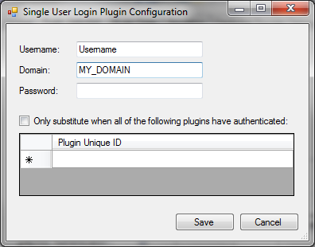

pGina Single User Plugin Documentation
===================

* **Plugin Name:** Single User
* **Plugin Type:** Gateway
* **Latest Version:** 3.0.0.0

How it Works
--------------------

The Single User plugin forces all authenticated and authorized users to log on to the machine
under a single local account.  The account need not exist, but if it doesn't exist,
the Local Machine plugin should be enabled within the gateway stage to manage the creation
of the account.

When this plugin is used, it should be placed before the Local Machine plugin in the gateway
stage.

This plugin always registers success.

Configuration
----------------------

* **Username** -- The username of the local account.
* **Domain** -- The domain of the local account.
* **Password** -- The password of the local account.
* **Only substitute when all of the following plugins have authenticated** -- When this is checked,
the plugin will not change the user's credentials to the credentials provided above unless
all of the listed plugins registered success in the authentication stage.

The list of plugins requires the unique ID for each listed plugin.  This ID is available 
under the "Plugins" tab of the main pGina configuration interface.

