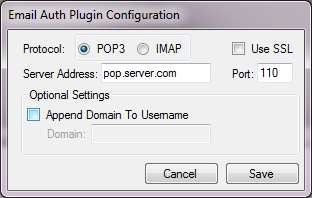

Email Authentication Plugin Documentation
===================

* **Plugin Name:** Email Authentication
* **Plugin Type:** Authentication
* **Latest Version:** 3.0.0.1

How it Works
--------------------

The Email Authentication plugin connects to the specified email server via
the POP3 or IMAP protocol and attempts to login to the server. If the
login is successful, a positive result is provided to the pGina service.

Typical Setup
---------------------
A typical (minimal) setup for Email Authentication is to enable the Local Machine 
plugin in the authentication and gateway stages, and enable the Email Auth plugin 
in the authentication stage. Within the authentication stage, order the Email Auth plugin 
before Local Machine.

A Note About Security
---------------------
If the email server supports SSL, using SSL is strongly recommended to ensure that
the login information can not be captured. If SSL is not available, the POP3 protocol
will attempt to authenticate using APOP if available to prevent sending the password
as plaintext. If APOP is not available, or the IMAP protocol is being used, the 
password will be sent to the email server as plain text. 

Configuration
---------------------

The configuration interface for the email authentication plugin is shown below.

Each configuration option is described below:

* **Protocol** -- The protocol for the server. 
* **Use SSL** -- Whether or not to use SSL encryption when connecting to the server.
* **Server Address** -- The address of the email server that should be authenticated against.
* **Port** -- The port used when connecting to the email server.
* **Append Domain to username** -- If checked, the domain specified below will be 
appended to the username when validating the credentials.
* **Domain** -- The domain to append to the username. E.g. For a username 'joe',
 and a domain 'test.com', the username sent to the email server will be 'joe@test.com'.