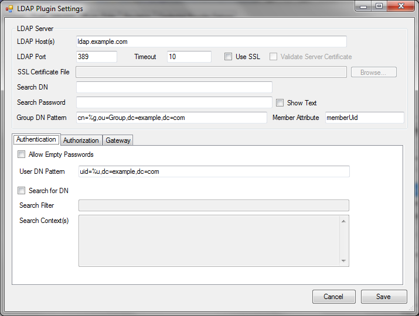
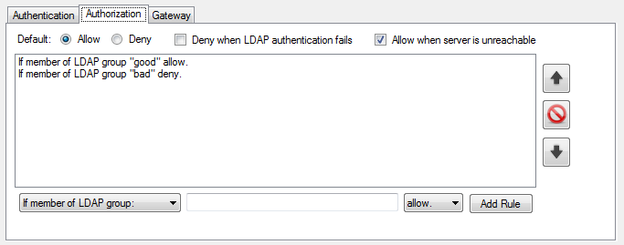
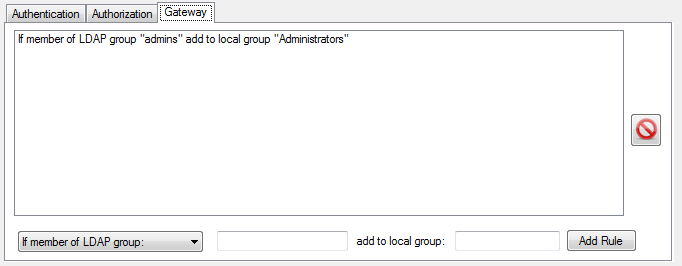

LDAP Plugin Documentation
===================

* **Plugin Name:** LDAP
* **Plugin Type:** Authentication, Authorization, Gateway
* **Version:** 3.1.x

How the LDAP Plugin Works
--------------------------

The LDAP plugin provides pGina services using an LDAP server as the primary data
source. It provides support for SSL encryption and failover to one or more
alternate servers.

<h3>Authentication</h3>

In the authentication stages, this plugin maps the user name to a LDAP
Distinguished Name (DN) and attempts to bind to the LDAP server using the DN. If
the bind is successful, it provides a positive result to the pGina service.

The user name can be mapped to a DN by one of two means: simple pattern
substitution, or via a search of the LDAP database. When a search is used, the
plugin connects to the LDAP server anonymously (or via supplied credentials) and
attempts to find an entry for the user. If the entry is found, the plugin closes
the connection and attempts to bind again using the DN of the entry, and the
password provided by the user. If this bind is successful, the plugin registers
success.

<h3>Authorization</h3>

In the authorization stage the LDAP plugin can authorize users based on membership
in LDAP groups.  The plugin searches the LDAP tree for group membership and 
allows or denies based on a set of rules that can be configured via the 
configuration interface (see below).

If the LDAP server cannot be contacted, it can be configured to allow or deny 
access.  It can also be configured to deny if the LDAP plugin fails in the
authentication stage.

<h3>Gateway</h3>

In the gateway stage, this plugin can add the user to local groups based on
membership in LDAP groups.  The plugin will search the LDAP tree for group membership
then add the user to local groups based on a set of rules (see below).  A common
use for this is to add the user to the local Administrators group when the user
is a member of a given LDAP admin group.

Typical Setup
-------------------

A typical (minimal) setup for LDAP authentication is to enable the Local Machine plugin in the 
authentication and gateway stages, and enable LDAP in the authentication stage.  Within the 
authentication stage, order the LDAP plugin before Local Machine.

Configuration
---------------

The configuration interface for the LDAP plugin is shown below.

The configuration options are described below:

* **LDAP Host(s):** -- A space separated list of one or more LDAP servers.  This field supports
  IP addresses or fully qualified domain names.
* **LDAP Port** -- The port used when connecting to the LDAP server(s).  Typically, this is
  389 for non-SSL connections (or connections using StartTLS), and 636 when SSL is used.
* **Timeout** -- This is the number of seconds to wait for a response from a server before
  giving up (and possibly moving on to the next server in the list).
* **Use SSL** -- Whether or not to use SSL encryption when connecting to the server(s).
* **Verify Server Certificate** -- Whether or not to verify the server's public certificate with
  a local certificate or certificate store.  When this option is selected, the connection will fail
  if the server's certificate does not validate.
* **SSL Certificate File** (optional) -- If you have selected "Verify Server Certificate," you can provide
  a copy of the server's public SSL certificate here.  The certificate should be provided in the
  "PEM" format that is the default for OpenSSL.  If this field is left blank, the plugin will attempt
  to use the Windows certificate store to validate the certificate.
* **Search DN** -- The DN to use when binding to the server in order to perform
  searches. If this is left empty, the plugin will attempt to bind anonymously.  This
  is used for searching for group membership or for searching for a user's DN.
* **Search Password** -- The password to use when binding with the above DN.  
  This is ignored if the "Search DN" field is empty (anonymous bind).
* **Group DN Pattern** -- The pattern to be used when converting a group name
  to an LDAP DN.  Use `%g` as a placeholder for the group name.  For example, if
  group membership is stored in the LDAP server under the `ou=Group,dc=example,dc=com`
  subtree, one might use the following as the pattern: `cn=%g,ou=Group,dc=example,dc=com`.
  This would map group `foo` to the DN: `cn=foo,ou=Group,dc=example,dc=com`.
  This option should be provided if you are using the LDAP plugin in the authorization
  and/or gateway stages.
* **Member Attribute** -- The LDAP attribute that is used to store group 
  members.  For example, if you are using the `posixGroup` object class to store
  your groups in the LDAP tree, the attribute is `memberUid`.  If you are using
  the `groupOfNames` object class, you would use `member` here.  This option
  should be provided if you are using the LDAP plugin in authorization or
  gateway stages.

<h3>Authentication Options</h3>

* **Allow Empty Passwords** -- If this is checked, the plugin will attempt to
  authenticate the user even if the password is empty.  When unchecked, it will
  fail to authenticate the user without attempting to bind to the LDAP server.
  Note that some servers may treat an empty password as an anonymous bind, 
  so it is a good idea to leave this unchecked (the default).
* **DN Pattern** -- If "Search for DN" is not selected, the user name is mapped 
  to a DN using this pattern.  The substring `%u` will be replaced with the user 
  name.
* **Search for DN** -- When this option is selected, the "DN Pattern" 
  (mentioned above) is ignored.  Instead, the plugin will attempt to connect to 
  the LDAP server (using the `Search DN` and `Search Password` credentials), 
  and search for an entry using the Search Filter and Search Context(s) provided.
  If the entry is found, the DN for the entry is used to re-bind to the server.
  If the re-bind succeeds, the plugin registers success.
* **Search Filter** -- This is a LDAP search filter to be used when searching 
  for the DN.  For more information on LDAP search filters, see 
  [this RFC](http://tools.ietf.org/html/rfc4515),
  or any LDAP book.  If the string `%u` appears in the filter, it will be replaced 
  by the user name.
* **Search Context(s)** -- This is a list of DNs (one per line) that are to be 
  used as search contexts.  This means that the search will be performed on the 
  LDAP subtree rooted at each of these DNs.

<h3>Authorization Options</h3>

The authorization tab provides an interface for creating, removing, and 
deleting authorization rules.  The rules are tested by the plugin in order
and the first matching rule is applied.  If none of the rules match, the
default rule is applied.  The default is configured using the radio buttons at
the top of the tab interface.

The other configuration options are described below:

* **Deny when LDAP authentication fails** -- If this is checked, authorization
  fails when the LDAP plugin fails to authenticate the user in the authentication
  stage or the LDAP plugin does not execute in that stage.
* **Allow when server is unreachable** -- When this is checked, the plugin
  will allow (succeed authorization) when the LDAP server is unavailable or some
  other error occurs that causes a failure to contact the LDAP server.  If this is
  unchecked, the user is denied authorization under the same circumstaces.

<h3>Gateway Options</h3>

The gateway tab provides options for creating and removing rules for adding
local groups based on LDAP group membership.  The rules are all applied in order
from top to bottom.  All rules are applied regardless of how many are a match
for the user logging in.  

When users are removed from LDAP groups, they may not be removed from the local
groups without careful configuration of the LocalMachine plugin.  For this to
work properly, you should make sure to configure the LocalMachine plugin to 
scramble passwords and/or to remove accounts and profiles after logout.  This 
will make sure that the LocalMachine plugin does not retain group information
on consecutive logins.  For more information, see the documentation for the
LocalMachine plugin.

Note that it is important to make sure that this plugin executes prior to the
LocalMachine plugin in the gateway stage.  This is because the LocalMachine
plugin is responsible for actually adding the local account to the local groups.
If it executes prior to the LDAP plugin, it will not apply the groups that have
been added by this plugin.

