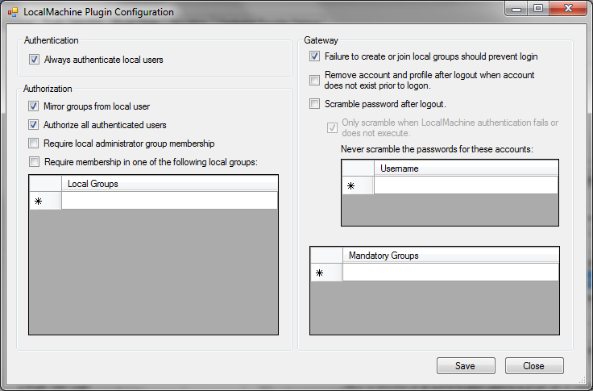

pGina Local Machine Plugin Documentation
===================

* **Plugin Name:** Local Machine
* **Plugin Type:** Authentication, Authorization, Gateway
* **Latest Version:** 3.0.1.0

How it Works
--------------------

The local machine plugin manages authentication and authorization for accounts
that exist on the machine itself.  It also is responsible for creating local
accounts (possibly temporary ones) when a user is authorized to log in, but
does not have a local account.  Much of the functionality provided by this
plugin was formerly part of the core in pGina 2.x and earlier.

The local machine plugin can execute in any or all of the three main pGina stages
(authentication, authorization, and gateway).

### Authentication Stage

In the authentication stage, the local machine plugin attempts to authenticate
the user's credentials against an existing local account.  If the local user 
account does not exist, or the credentials do not match, the
plugin registers failure for this stage.

It can be configured to always attempt to authenticate, or to only do so 
if the user has not already been authenticated by a plugin that was 
executed earlier within this stage.

If the LocalMachine plugin authenticates the user, it will copy the group
membership of the local account into pGina's internal list of groups.  Note
that this will NOT happen if it does not successfully authenticate the user.  
However, the authorization stage can be configured to do so anyway.

Note that you probably always want to make sure that the local machine plugin
is enabled in the authentication stage.  If not, you risk being unable to
log into the machine if for some reason the alternate authentication methods
fail (such as a network issue).

### Authorization Stage

The local machine plugin authorizes users based on group membership.  It can be 
configured such that a user must be a member of the administrator group to be
authorized, and/or the user must be a member of one of a set of other local
groups.

The plugin can also be configured to only apply these rules to accounts that
were authenticated by this plugin and not by others.  Or alternatively, it can
apply these authorization rules to all authenticated users.

### Gateway Stage

If enabled in the gateway stage, the local machine plugin ensures that the
authenticated (and authorized) user has a local account.  If not, one is created.
It also makes sure that the local account has the appropriate group membership.
Note that this stage may modify the group membership of a local account 
(see "Local Groups" below).
You can also configure the plugin to add the user to a set of mandantory groups.

We recommend that you have this plugin enabled in the gateway stage if you are using
non-local account logins such as LDAP or MySQL Authentication.

The plugin can also be configured such that the local account should be scheduled
for removal or have its password scrambled upon logoff.  This is implemented in the
following way.  Upon successful completion of this stage, it records the username
as a successful login.  A background thread wakes up every so often to 
check if the user has logged off.  If so, the plugin tries to delete the 
account/profile and/or scramble the password.

### Local Groups

In the gateway stage, this plugin will make sure that the group membership of
the local account is an exact match with the list of groups provided by the 
plugins.  This can potentially remove or add groups to an existing account.
In order to understand this, consider the pGina login
process.  During the execution of the pGina pipeline, plugins can
add or remove groups from an internal list of groups.  This list is initially
empty at the beginning of the pipeline.
When the gateway stage is executed, 
the LocalMachine plugin sees this list of groups of which the user should be a
member, and attempts to make sure that the actual local 
account is a member of the same list of groups (no more, no less).  To do so, 
it may remove or add groups to the local account as necessary.

There are two locations where the group membership of the local account may be
copied into the internal list of groups.  First, in the authentication stage
the LocalMachine plugin will copy the group membership if the user is successfully
authenticated by the plugin.  Second, the authorization stage will copy the group
membership of the local account if configured to do so (see the "Mirror groups from
local user" option below).

Care must be taken to avoid removing needed groups.  As an example of the kind 
of thing that might happen, consider the following 
scenario.  Suppose that account `foo` exists locally on the machine and in LDAP.  The local
account is a member of the `Administrators` group.  The LDAP plugin is enabled
in the authentication stage and the LocalMachine plugin is enabled in authentication and
gateway stages.  Further,
suppose that the LDAP plugin is configured to authenticate prior to the LocalMachine
plugin, and the LocalMachine settings are the default settings.

The following scenario then occurs:

1.  User logs on to the machine using credentials that are valid for LDAP, but not
   for the local account.  This might happen if the local account's password was
   scrambled by the LocalMachine plugin (see configuration below), or the LDAP
   password was changed and the local account's password hasn't been updated.
   
2.  The user is authenticated by LDAP plugin, but fails authentication in the
   LocalMachine plugin.  The internal list of groups is empty because the
   LocalMachine plugin failed to authenticate and therefore did not add any 
   groups to the list (see "Authentication" above).
   
3.  The LocalMachine plugin does not execute in the authorization stage because
   in the default configuration, the authorization stage is not enabled.
  
4.  In the gateway stage, the internal list of groups is empty so the Administrators
   group is removed from the local account prior to logon.
   
If this is not the desired outcome from this scenario, one solution is to enable
the authorization stage for the LocalMachine plugin and make sure that the 
"mirror local groups" option is enabled and the "authorize all authenticated
users" option is also enabled.

Also, note that you probably want to make sure that the LocalMachine plugin
executes **last** in the gateway stage.  This is because there may be other
plugins who change the group membership in the gateway stage.  They should
do so before the LocalMachine plugin executes because it is the LocalMachine
plugin that makes sure that the local account is actually a member
of the internal list of groups.

Configuration
--------------------

* **Always authenticate local users** -- When this is checked, the plugin will always
attempt to authenticate the user against a local account.  If this is not checked, 
the plugin will only attempt to authenticate when the user has not already been
authenticated by a plugin that has executed earlier within the authentication stage.
* **Mirror groups from local user** -- Load all groups from the local account into
the pGina user information store so that the LocalMachine's Gateway stage 
(and other subsequent plugins) will see that the 
user should be a member of those groups.  When this plugin is enabled in the Gateway 
stage, it will attempt to make sure that the local account has the same groups 
as listed in the internal user information store.  This is automatically done
if the user was authenticated by this plugin regardless of the state of this
option.
* **Authorize all authenticated users** -- When this is checked, the plugin will 
attempt to authorize all users.  Otherwise, the plugin will only authorize
users that were authenticated successfully by this plugin.
* **Require local administrator group membership** -- Only authorize users that are
members of the Administrators group.
* **Require membership in one of the following local groups** -- Only authorize users
that are members of one of the groups listed below this checkbox.
* **Failure to create or join local groups should prevent login** -- When this is 
checked, the plugin will register failure if it is unable to create or join the
local groups that are requested.
* **Scramble password after logout** -- When this is checked, the plugin will attempt
to scramble the password of the local account after logout.  Note that it will **not** do so if
the local account exists prior to logon.
* **Remove account and profile after logout** -- When this is selected, the plugin
will attempt to remove the account and its profile after logout.  Note that it will
**not** do so if the local account exists prior to logon.
* **Mandantory groups** -- The local account is added to these local groups if not
already a member.
