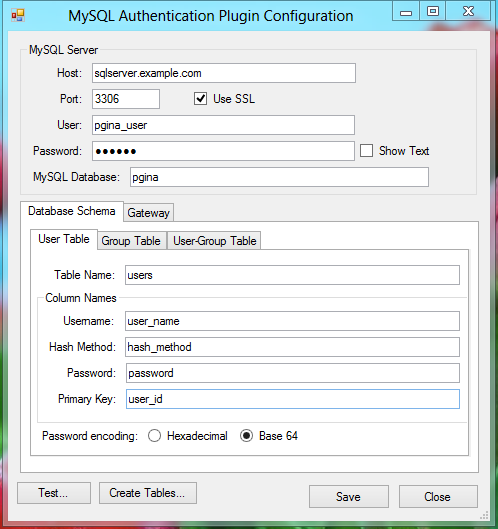
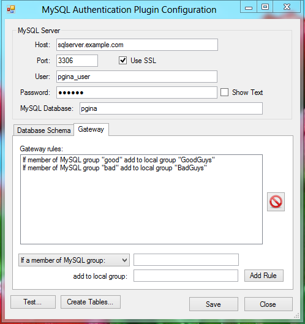

pGina MySQL Authentication Plugin Documentation
===================

* **Plugin Name:** MySQL Authentication
* **Plugin Type:** Authentication, Gateway
* **Version:** 3.1.x

How it Works
-----------------

The MySQL Authentication plugin authenticates users against account information stored in a 
MySQL database.  The plugin connects to the MySQL server, retrieves the account information
including password (possibly a hash), and compares the user supplied password with the one
retrieved from the database.  It registers success if the passwords (or hashes) match.

As of version 3.1, this plugin also supports adding users to local groups based
on group membership information stored in the MySQL database.

The database schema is fairly flexible and configurable (see below).

Typical Setup
-------------------

A typical (minimal) setup for MySQL Authentication is to enable the Local Machine plugin in the 
authentication and gateway stages, and enable MySQL Auth. in the authentication stage.  Within the 
authentication stage, order the MySQL plugin before Local Machine.

The Database Schema
-----------------------------

The schema includes three tables:

 * A user table
 * A group table
 * A user-group table

The third table (user-group) links users to groups.  It contains only two 
coumns.  Each column is a foreign key linking to the user and group tables
respectively.

The user table must have at least three or four columns (the column names
can be configured):

* Username - The column containing the user name.  This column should be unique 
  (or the primary key).
* Hash Method - The hash method used for storing the password.  This can be one
  of several strings (see below).
* Password - The (possibly hashed) password.
* Primary key - This column is the primary key for this table.  This column can
  be the same as the username column.

If the primary key is the same as the username, then there are only three 
columns, otherwise there are four.

The Hash Method column can have one of the following values:

* `NONE` - The password is stored in plain text.
* `MD5`, `SHA1`, `SHA256`, `SHA384`, or `SHA512`
* `SMD5`, `SSHA1`, `SSHA256`, `SSHA384`, or `SSHA512` (The salted versions of above)

The group table must have at least one or two columns (column names are
configurable):

* Group name - The column containing the group name.
* Primary key - The primary key (can be the same as the group name column).
  
The user-group table must have exactly two columns which are foreign keys linking
to the user and group tables:

* User foreign key - The foreign key to the user table.
* Group foreign key - The foreign key to the group table.

This table stores the group membership information.

### Salted Passwords

If any of the salted hash methods are used, this plugin expects the data to be
organized as follows.  The `password` column must contain a hexadecimal or
base 64 encoded string that contains the following:

**encoding** ( **hash**( *password* + *salt* ) + *salt* )

Where **encoding** converts to a string using either hexadecimal or base 64 
encoding, and **hash** applies the appropriate hash algorithm.

Configuration
-------------------

* **Host** -- The IP or fully-qualified hostname of the MySQL server.
* **Port** -- The port where the MySQL server process is listening.
* **User** -- The username to use when connecting to the MySQL server.
* **Password** -- The password to use when connecting to the MySQL server.
* **Use SSL** -- Whether or not to use SSL encryption when connecting to the MySQL server.
  Note that for this to work correctly, your MySQL server must have SSL enabled.  For more 
  information on setting up a MySQL server with SSL, see 
  [the MySQL documentation](http://dev.mysql.com/doc/refman/5.1/en/secure-connections.html).
* **MySQL Database** -- The database containing the account information table.

<h3>Database Schema Configuration</h3>

Under the "Database Schema" tab, you can configure the column names and table
names.  Note that any table may include more columns than those listed here.
The primary key for the user table may have the same name as the username column.
If so, they are treated as a single column.  Similarly for the primary key for
the group table.

The "Password encoding" radio buttons indicate the binary encoding used in 
the password column of the database.

The "Test..." button initiates a test of the MySQL connection, and verifies that the tables
exist and are properly formatted.

The "Create Table..." button attempts to connect to the MySQL server and create the
information tables.

<h3>Gateway Configuration</h3>

Under the "Gateway" tab you can configure a set of rules to be applied within
the gateway stage.  This allows you to add the user to local groups based on
membership in MySQL groups.
