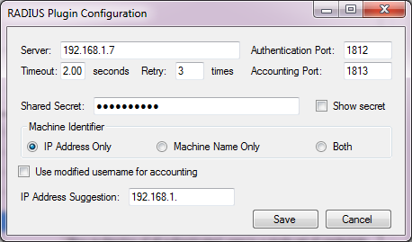

Email Authentication Plugin Documentation
===================

* **Plugin Name:** RADIUS Authentication & Accounting Plugin
* **Plugin Type:** Authentication, Notification
* **Latest Version:** 3.0.0.0

How it Works
--------------------

The RADIUS plugin authenticates against a RADIUS source during the authentication
stage and sends accounting requests during the notification stage.

Typical Setup
---------------------
A typical (minimal) setup for the RADIS plugin is to enable the Local Machine 
plugin in the authentication and gateway stages.

If you would like to authenticate users against the RADIUS source, enable the RADIUS plugin 
in the authentication stage. Within the authentication stage, order the RADIUS plugin 
before Local Machine.

If you would like to enable accounting, enable the RADIUS plugin during the notification
stage. 

Configuration
---------------------

The configuration interface for the RADIUS plugin is shown below.

Each configuration option is described below:

* **Server** -- The RADIUS server to sending authentication and accounting requests to
* **Authentication Port** -- The port used for authentication. Default is 1812, though legacy RADIUS servers may default to 1645.
* **Accounting Port** -- The port used for accounting. Default is 1813, though legacy RADIUS servers may default to 1646.
* **Timeout** -- The amount of time in seconds to wait for a response from the RADIUS server
* **Retry** -- The number of times to retry sending a RADIUS packet in the case of a timeout.
* **Shared Secret** -- The shared secret of the RADIUS server.
* **Machine Identifier** -- A client computer may identify itself by its' IP address or a unique name (or both). 
* **Use modified username for accounting** -- The RADIUS plugin will log the username entered by the user 
by default. If you would like to log the name after it has been modified (by the Modify 
Username or Single User Login plugins for example), check this.
* **IP Address Suggestion** -- When recording the IP address of the machine, the plugin will record the first viable IP
address in the system. In setups with multiple network adapters (including virtual adaptors), this may record the wrong address.
You may enter any regular expression that will match the desired IP address. For example "192.168.1." will attempt to find an 
address matching the 192.168.1 subnet. "192.168.(24|25)." will match the 192.168.24 or 192.168.25 subnets. If no match is found,
the first viable IP address is used. 