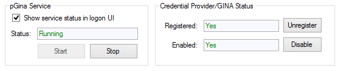

pGina User's Guide
===================

## Contents
* [Installation](#install)
* [How pGina Works](#howworks)
* [Selecting and Configuring Plugins](#selecting)
* [Ordering Plugins](#ordering)
* [Testing Plugins](#testing)
* [Logging](#logging)

<h2 id="install">Installation</h2>

pGina is packaged in a standard Windows installer, so installation is as easy as
downloading and running the installer.  After initial installation, pGina will be
configured with the "LocalMachine" plugin enabled for the authentication 
and gateway stages (see below).  This means that you will be able to use 
pGina out-of-the-box to log 
into the machine using existing local accounts, and if necessary, the 
LocalMachine plugin will create accounts for authenticated users.

In addition to the "LocalMachine" plugin, a standard set of additional plugins 
is provided and made available, but none of them are initally enabled.

<h3>Verify Install</h3>

After installation, start the pGina configuration application.  Verify that the pGina service
is running and that the Credential Provider/GINA is installed and enabled.  

pGina will not
function properly unless these components are working.  More information about
the Credential Provider and pGina service is provied in the next section.

<h2 id="howworks">How pGina Works</h2>

pGina is a replacement for the default Windows credential provider (the part
of the system that manages logins).  Through plugins, pGina allows you to
configure many aspects of the login process from authentication and authorization
through to logging and terminal events.

<h3>pGina Components</h3>

pGina consists of two main components:  the Credential Provider (or GINA), and the 
pGina service (which manages the plugins).

For the following discussion, we'll refer to the Credential Provider or GINA as simply
the CP.  If you are running pGina on XP or earlier, you can replace CP with GINA.

The CP augments or replaces the default Windows
authentication functionality.  It plugs-in to the Windows
system and can configure the user interface that is displayed
at login time (or during unlock, UAC control, etc.) as well as do custom
authentication.  The pGina CP, however, does very 
little on its own.  It simply receives the user's credentials and passes
them along to the pGina service via a named pipe, and then waits for a response
from the service.  User authentication/authorization
is instead managed by the plugins that run within the pGina service.

The pGina service is a standard Windows service that is started at boot time,
and runs with administrator priviledges.  Note that upon initial boot, it may take 
some time for pGina service to start, and the CP will (of course) be unable to 
communicate with the service until it is started.

<h3 id="plugins">Plugins</h3>

pGina manages the Windows login process by delegating the work to a set of zero or more
plugins.  Plugins have the job of deciding whether or not the user is who she
says she is (authentication), whether the user should be granted access 
(authorization), and taking other login-time actions.  The process involves
three main stages as illustrated in the following diagram.

Each stage involves zero or more plugins, and a given plugin may be involved
in multiple stages.  After the user provides his/her credentials, pGina passes through the three
stages one at a time, in the order shown above.  Each stage may succeed or 
fail depending on the results of the plugins involved.  The purpose of each
stage is summarized below.

* __Authentication__ - Plugins involved in this stage validate that the user is
  who he/she says she is.  This might be done by validating the credentials against
  some external database or other source.
* __Authorization__ - This stage is intended to determine whether or not the 
  user (who is already authenticated) is allowed to access the resources that
  are being requested.  For example, a user might only be allowed to login if 
  they are a member of certain groups.
* __Gateway__ - This is similar to the Authorization stage in that it may fail,
  however, the intention is not to authorize users, but to provide post-authorization
  account management that may fail.  For example, the "Local Machine" plugin 
  executes within the gateway stage.  It is responsible for creating (if necessary) a local
  Windows account that matches the credentials of the user that is logging in.  
  If for some reason, this fails, then the user cannot be logged in, and this
  plugin must stop the login process and provide an appropriate
  error message.  In general, this stage provides a "last chance" for a login
  to fail (post authenticate/authorize).
  
Plugins can be configured to provide services for zero or more of the above stages.
For example, the "LocalMachine" plugin provides services for all three stages.  In
the authentication stage, it verifies that the user's credentials match that of
some existing local account, and in the authorization state, it verifies that the
authenticated user is allowed to log on to the machine.

There can be zero or more plugins involved with each stage.  If any stage fails,
the login fails.  However, stages have different rules regarding when a stage
succeeds or fails.

* __Authentication__ - At least one of the plugins involved in this stage must register
  success for the process to continue.  If there are zero plugins registered, 
  this stage fails.
* __Authorization__ - All plugins involved in this stage must register success
  for the process to continue.  If there are no plugins registered, this stage
  succeeds.
* __Gateway__ - All plugins involved in this stage must register success for 
 the process to continue.  If there are no plugins registered, this stage
 succeeds.  However, the "Local Machine" plugin will almost always be registered
 in this stage.

Plugins can provide services to multiple stages, and these services can be
selectively turned on or off.  For example, consider plugin Foo that provides
Authentication and Authorization.  pGina can be confiured such that Foo only 
provides Authentication, only Authorization, both, or neither.  Configuration
is described later in this document.

Plugins can also be ordered within each stage.  For example, suppose plugins
Foo and Bar are providing services to the user session stage.  We can configure
Foo to be invoked before Bar, or Bar before Foo.

<h3>Event Notifications</h3>

Plugins may also register to recieve event notifications from Windows 
Terminal Services.  These events include: logon, logoff, lock, unlock,
console connect, console disconnect, and a few others (see 
[msdn](http://msdn.microsoft.com/en-us/library/system.serviceprocess.sessionchangereason.aspx)
for a full list).  A plugin that desires to
recieve these notifications will be listed as a "Notification"
plugin in the configuration interface.  The plugin will not recieve 
events unless it is enabled (see the section on configuration below).

<h2 id="selecting">Selecting and Configuring Plugins</h2>

In the pGina configuration interface, plugins can be enabled/disabled under
the "Plugin Selection" tab.  If a plugin provides services for a given stage,
a checkbox will appear in the appropriate column.  You can enable/disable a 
plugin for a given stage by using the checkbox.  

To configure a plugin, double click on it or select it and click on 
"Configure..".   The plugin's configuration dialog will appear.  The
options are plugin specific, and you should refer to the documentation for
each plugin for details about configuration of an individual plugin.

<h2 id="ordering">Ordering Plugins</h2>

Under the "Plugin Order" tab, you can determine the order that each plugin
is invoked.  There is a list for each pGina stage, and you can re-order the
plugins within each list.

<h2 id="testing">Testing Plugins</h2>

To verify that your plugins are configured and working properly, pGina provides
a login simulator that can be found under the "Simulation" tab in the pGina 
configuration interface.   With the simulator, you can initiate a simulated
login, and verify success or failure of each pGina stage.  The simulator also
provides a "live" view of the pGina log files directly within the UI.  If something
fails to work as expected, you should be able to find information within the 
log view regarding what occured.

<h2 id="logging">Logging</h2>

pGina logs information to the following files, found in the main pGina installation
directory ( typically `C:\Program Files\pGina\log` ).

* `pGina.Configuration_log.txt` -- This contains log messages from the pGina configuration
application.  
* `pGina.Service.ServiceHost_log.txt` -- This file contains log messages from the pGina service.
* `pGina.CredentialProvider.Registration_log.txt` -- This contains log messages from the
registration utility that is used during installation/uninstallation to enable/disable the
CP and pGina service.

Logging support in pGina is supported by [Apache log4net](http://logging.apache.org/log4net/),
and is configured within the log4net configuration file, which is (by default) located
here: 

`C:\Program Files\pGina\log4net.config`.  

If you would like to log to a different file,
simply edit this file.  For details about log4net configuration, see the 
[Apache log4net documentation](http://logging.apache.org/log4net/release/manual/introduction.html).
